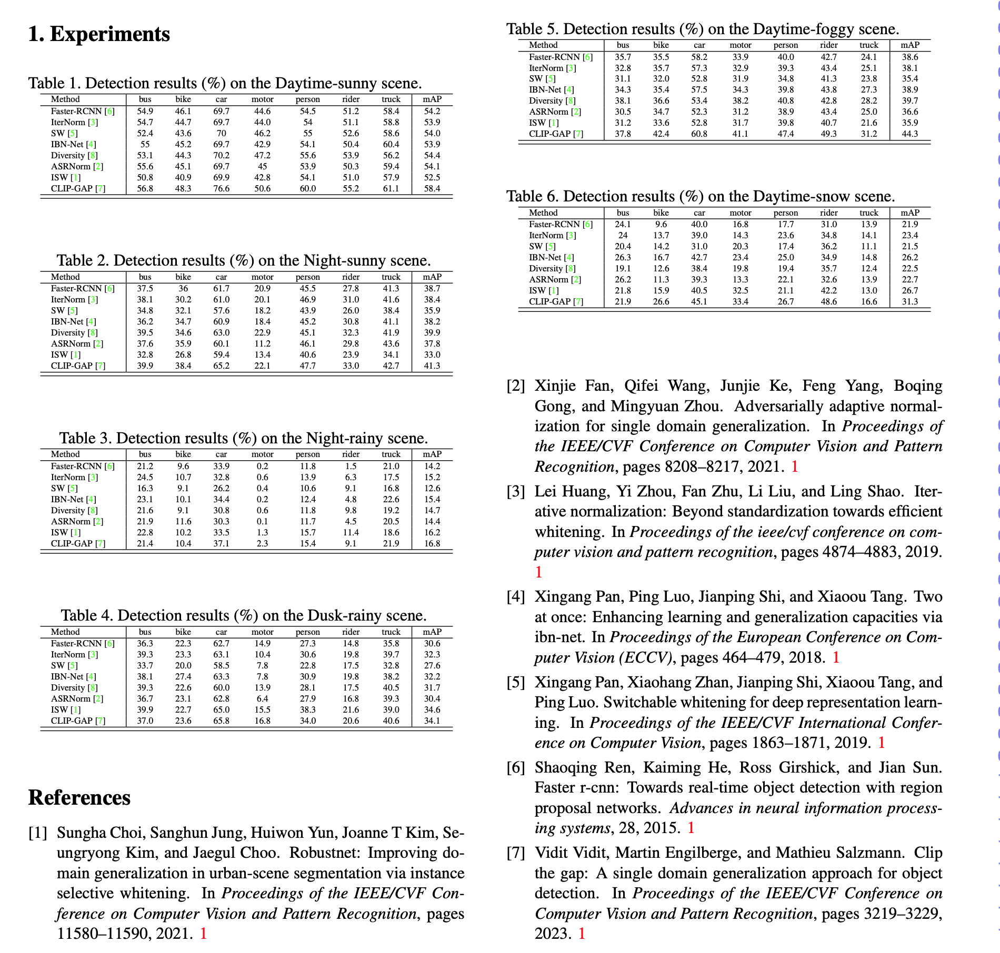

# Single-DGOD-V2
This repo is the implementation of Single-Domain Generalized Object Detection.

## Environments:
- Python 3.7
- PyTorch 1.7.1
- torchvision 0.8.2

Install the package:
```
pip install -r requirements.txt
```

## Installation
  - Our codes are based on [MMDetection](https://github.com/open-mmlab/mmdetection). Please follow the installation of MMDetection and make sure you can run it successfully.
  - This repo uses mmdet==2.13.0 and mmcv-full==1.3.17

setup:
```
python setup.py develop
export NPY_MKL_FORCE_INTEL=1
export MKL_SERVICE_FORCE_INTEL=1
```

## Datasets
We have constructed the 2nd version of the **Diverse Weather Dataset**, which has added a new snowy urban scene. This dataset contains the following scenarios, **Daytime-Sunny**, **Night-Sunny**, **Dusk-Rainy**, **Night-Rainy**, **Daytime-Foggy**, and **Daytime-Snowy**.

[[Google Drive](https://drive.google.com/drive/folders/1PlQsF8pEWbh1Fc_EMTgp5wLoIeL_z-O_?usp=sharing)]

The dataset format of each domain is the Pascal VOC format.
The data file structure should be as follows:
```
    └── data
        ├── daytime_sunny
        │   └── VOC2007
        │   │   ├── Annotations
        │   │   ├── ImageSets
        │   │   │   └── Main
        │   │   └── JPEGImages
        ├── night_sunny
        │   └── VOC2007
        │   │   ├── Annotations
        │   │   ├── ImageSets
        │   │   │   └── Main
        │   │   └── JPEGImages
        ├── night-rainy
        │   └── VOC2007
        │   │   ├── Annotations
        │   │   ├── ImageSets
        │   │   │   └── Main
        │   │   └── JPEGImages
        ├── dusk-rainy
        │   └── VOC2007
        │   │   ├── Annotations
        │   │   ├── ImageSets
        │   │   │   └── Main
        │   │   └── JPEGImages
        ├── daytime_foggy
        │   └── VOC2007
        │   │   ├── Annotations
        │   │   ├── ImageSets
        │   │   │   └── Main
        │   │   └── JPEGImages
        └── daytime_snowy
            └── VOC2007
                ├── Annotations
                ├── ImageSets
                │   └── Main
                └── JPEGImages
```

## Training

```
# single-gpu training
python tools/train.py configs/faster_rcnn/faster_rcnn_r101_fpn_2x_daytime_sunny.py  --work-dir './output'

# multi-gpu training
CUDA_VISIBLE_DEVICES=0,1 bash tools/dist_train.sh configs/faster_rcnn/faster_rcnn_r101_fpn_2x_daytime_sunny.py 2 --work-dir './output' 
```

## Evaluation

```
# test on daytime_sunny domain
python tools/test.py configs/faster_rcnn/faster_rcnn_r101_fpn_2x_daytime_sunny.py 'model_path' --eval mAP 
# test on daytime_foggy domain
python tools/test.py configs/faster_rcnn/faster_rcnn_r101_fpn_2x_daytime_foggy.py 'model_path' --eval mAP 
# test on night_rainy domain
python tools/test.py configs/faster_rcnn/faster_rcnn_r101_fpn_2x_night_rainy.py 'model_path' --eval mAP 
# test on night_sunny domain
python tools/test.py configs/faster_rcnn/faster_rcnn_r101_fpn_2x_night_sunny.py 'model_path' --eval mAP 
# test on dusk_rainy domain
python tools/test.py configs/faster_rcnn/faster_rcnn_r101_fpn_2x_dusk_rainy.py 'model_path' --eval mAP 
# test on daytime_snowy domain
python tools/test.py configs/faster_rcnn/faster_rcnn_r101_fpn_2x_daytime_snowy.py 'model_path' --eval mAP 
```
## Results


## Citation

If you find this repository useful for your work, please cite as follows:

```
@inproceedings{wu2022single,
  title={Single-Domain Generalized Object Detection in Urban Scene via Cyclic-Disentangled Self-Distillation},
  author={Wu, Aming and Deng, Cheng},
  booktitle={Proceedings of the IEEE/CVF Conference on Computer Vision and Pattern Recognition},
  pages={847--856},
  year={2022}
}

```

## Acknowledgement
Our code is based on the project [MMDetection](https://github.com/open-mmlab/mmdetection).
